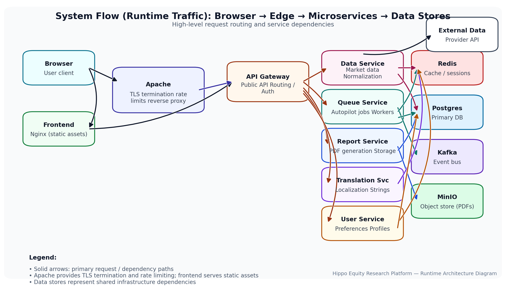

<div align="center">


**Enterprise-grade microservices platform for equity research workflows**

[Features](#-platform-highlights) • [Quick Start](#-quick-start) • [Architecture](#-architecture) • [Documentation](#-documentation) • [Contributing](#-contributing)

</div>

---

##  Table of Contents

- [Overview](#-overview)
- [Platform Highlights](#-platform-highlights)
- [Architecture](#-architecture)
- [Tech Stack](#-tech-stack)
- [Quick Start](#-quick-start)
- [Installation](#-installation)
- [Configuration](#-configuration)
- [Service URLs & Ports](#-service-urls--ports)
- [Development](#-development)
- [Testing](#-testing)
- [Deployment](#-deployment)
- [Monitoring & Observability](#-monitoring--observability)
- [Security](#-security)
- [Performance](#-performance)
- [Troubleshooting](#-troubleshooting)
- [Documentation](#-documentation)
- [Contributing](#-contributing)
- [License](#-license)

---

##  Overview

Hippo Equity Research Platform is a **production-ready, enterprise-grade microservices architecture** designed for comprehensive equity research workflows. The platform provides:

- **Real-time market data ingestion** with intelligent normalization and multi-layer caching
- **Scalable batch processing** via Kafka-based autopilot queues
- **Multi-language support** (6 languages) with persistent user preferences
- **Professional PDF report generation** with customizable templates and branding
- **Interactive financial dashboards** with advanced charting capabilities
- **Enterprise-grade reliability** with structured logging, health checks, and observability

Built with modern best practices, the platform is designed for **high availability**, **horizontal scalability**, and **operational excellence**.

## Platform Highlights

###  Core Capabilities

| Feature | Description | Technology |
|---------|-------------|------------|
| **Market Data Pipeline** | Real-time ingestion with intelligent normalization, multi-layer caching (Redis + PostgreSQL), and TTL-based invalidation | Express, Redis, PostgreSQL |
| **Autopilot Queue** | Kafka-based batch processing with FIFO ordering, real-time progress tracking, and webhook notifications | Apache Kafka, Redis |
| **Multi-Language Support** | 6 languages (en, es, fr, de, zh, he) with persistent preferences, language-specific caching, and dynamic translation | Translation Service, Redis |
| **PDF Report Generation** | Professional reports with customizable templates, charts, branding, and section-based builder | PDFKit, Canvas |
| **Interactive Dashboard** | Real-time financial charts with TradingView-like controls, news overlays, and sentiment analysis | React, lightweight-charts |
| **Enterprise Reliability** | Structured logging, comprehensive error handling, health checks, and graceful degradation | Winston, Express |
| **Security & Compliance** | HTTPS enforcement, API key authentication, input validation, rate limiting, and sanitized logging | Apache, Express |
| **Performance & Scalability** | Multi-layer caching, connection pooling, query optimization, and horizontal scaling support | Redis, PostgreSQL, Kafka |

###  Key Differentiators

- **Production-Ready**: Battle-tested architecture with comprehensive error handling and monitoring
- **Microservices Architecture**: Independent, scalable services with clear separation of concerns
- **Developer Experience**: Full TypeScript coverage, comprehensive documentation, and automated testing
- **Operational Excellence**: Health checks, structured logging, and observability built-in


##  Architecture

Hippo implements a **microservices architecture** with clear service boundaries, independent scaling, and resilient communication patterns.

### High-Level Architecture

```mermaid
graph TB
    subgraph "Client Layer"
        Browser[Web Browser]
        Mobile[Mobile App]
    end
    
    subgraph "Edge Layer"
        Apache[Apache Reverse Proxy<br/>TLS, Rate Limiting]
        Nginx[Nginx<br/>Static Assets]
    end
    
    subgraph "API Layer"
        Gateway[API Gateway<br/>Routing, Auth]
    end
    
    subgraph "Application Services"
        DataService[Data Service<br/>Market Data Ingestion]
        QueueService[Queue Service<br/>Batch Processing]
        ReportService[Report Service<br/>PDF Generation]
        TranslationService[Translation Service<br/>i18n]
        UserService[User Service<br/>Preferences]
    end
    
    subgraph "Data Layer"
        PostgreSQL[(PostgreSQL<br/>Persistent Storage)]
        Redis[(Redis<br/>Cache & Queue Status)]
        MinIO[(MinIO<br/>Object Storage)]
    end
    
    subgraph "Message Queue"
        Kafka[Apache Kafka<br/>Event Streaming]
    end
    
    Browser --> Apache
    Mobile --> Apache
    Browser --> Nginx
    Apache --> Gateway
    Gateway --> DataService
    Gateway --> QueueService
    Gateway --> ReportService
    Gateway --> TranslationService
    Gateway --> UserService
    
    DataService --> PostgreSQL
    DataService --> Redis
    QueueService --> Kafka
    QueueService --> Redis
    ReportService --> MinIO
    ReportService --> PostgreSQL
    UserService --> PostgreSQL
    UserService --> Redis

    linkStyle 0,1,2,3 stroke:#dc2626,stroke-width:2px,color:#dc2626;
    linkStyle 9,10,11,12,13,14,15,16 stroke:#16a34a,stroke-width:2px,color:#16a34a;
```

### Service Communication Flow

```
┌─────────┐
│ Browser │
└────┬────┘
     │ HTTPS (443)
     ▼
┌─────────┐     ┌──────────────┐
│ Apache  │────▶│ API Gateway  │
│ (Proxy) │     │  (Port 3000) │
└─────────┘     └──────┬───────┘
                        │
        ┌───────────────┼───────────────┐
        │               │               │
        ▼               ▼               ▼
  ┌──────────┐   ┌──────────┐   ┌──────────┐
  │   Data   │   │  Queue   │   │  Report  │
  │ Service  │   │ Service   │   │ Service  │
  └────┬─────┘   └────┬─────┘   └────┬─────┘
       │              │              │
       └──────┬───────┴──────┬───────┘
              │              │
        ┌─────▼─────┐  ┌────▼─────┐
        │ PostgreSQL │  │  Redis   │
        └────────────┘  └──────────┘
```

### Design Principles

- **Separation of Concerns**: Each service has a single, well-defined responsibility
- **Stateless Services**: Services are designed to be horizontally scalable
- **Event-Driven**: Kafka enables asynchronous processing and loose coupling
- **Caching Strategy**: Multi-layer caching (Redis → PostgreSQL) for optimal performance
- **Fail-Safe**: Graceful degradation and circuit breaker patterns

##  Tech Stack

### Backend Services
| Component | Technology | Version | Purpose |
|-----------|-----------|---------|---------|
| Runtime | Node.js | 20+ | JavaScript runtime |
| Framework | Express | 4.x | Web application framework |
| Language | TypeScript | 5.3 | Type-safe development |
| Database | PostgreSQL | 15 | Primary data store |
| Cache | Redis | 7 | Caching & session storage |
| Message Queue | Apache Kafka | 3.5 | Event streaming & queues |
| Object Storage | MinIO | Latest | S3-compatible storage |

### Frontend
| Component | Technology | Version | Purpose |
|-----------|-----------|---------|---------|
| Framework | React | 18.2 | UI library |
| Build Tool | Vite | 5.0 | Fast build & dev server |
| Language | TypeScript | 5.3 | Type safety |
| Charts | lightweight-charts | 5.1 | Financial charting |
| Styling | CSS Variables | Native | Theme system |

### Infrastructure
| Component | Technology | Purpose |
|-----------|-----------|---------|
| Reverse Proxy | Apache | TLS termination, rate limiting |
| Web Server | Nginx | Static asset serving |
| Containerization | Docker + Compose | Deployment & orchestration |

### Testing & Quality
| Tool | Purpose |
|------|---------|
| Jest | Unit & integration testing |
| Vitest | Fast unit tests for frontend |
| fast-check | Property-based testing |

##  Quick Start

Get Hippo up and running in **under 5 minutes**.

### Prerequisites

Ensure you have the following installed:

| Requirement | Minimum Version | Check Command |
|-------------|----------------|---------------|
| Docker | 20.10+ | `docker --version` |
| Docker Compose | 2.0+ | `docker-compose --version` |
| Git | Latest | `git --version` |

### Installation Steps

#### 1. Clone the Repository

```bash
git clone git@github.com:TheKingHippopotamus/Hippo_Equity_ResearchPlatform.git
cd Hippo_EquityResearch_App
```

#### 2. Automated Installation (Recommended)

```bash
# Install and build all services
./scripts/install.sh

# Start all services
./scripts/start.sh

# Verify health
./scripts/check.sh
```

**What happens:**
- ✅ Validates Docker installation
- ✅ Creates `.env` from template
- ✅ Builds all Docker images
- ✅ Starts all services in detached mode
- ✅ Waits for services to be ready

#### 3. Access the Platform

Once started, access the platform at:

- **Frontend Dashboard**: http://localhost:5173
- **API Gateway**: http://localhost:3000
- **Swagger UI**: http://localhost:3000/api-docs
- **Health Check**: http://localhost:3000/health
- **MinIO Console**: http://localhost:9001

### ⚠️ Important Configuration Note

**Data Provider Setup**: To obtain the provider URL, please contact the maintainer. The URL is obtained via scraping and is not publicly available.

**Repository**: [https://github.com/TheKingHippopotamus/Hippo_Equity_ResearchPlatform](https://github.com/TheKingHippopotamus/Hippo_Equity_ResearchPlatform)


## Installation

### Manual Installation

For advanced users who prefer manual control:

#### Step 1: Environment Configuration

```bash
# Copy environment template
cp .env.example .env

# Edit with your preferred editor
nano .env  # or vim, code, etc.
```

**Required Environment Variables:**

| Variable | Description | Example |
|----------|-------------|---------|
| `POSTGRES_DB` | Database name | `hippo_db` |
| `POSTGRES_USER` | Database user | `hippo_user` |
| `POSTGRES_PASSWORD` | Database password | `secure_password_123` |
| `REDIS_PASSWORD` | Redis authentication | `redis_secure_pass` |
| `MINIO_ROOT_USER` | MinIO admin user | `minioadmin` |
| `MINIO_ROOT_PASSWORD` | MinIO admin password | `minioadmin123` |
| `DATA_PROVIDER_API_URL` | External API endpoint | `https://api.provider.com` |
| `DATA_PROVIDER_API_KEY` | API key (optional) | `your_api_key_here` |

#### Step 2: Build Docker Images

```bash
# Build all services (this may take 5-10 minutes)
docker-compose build

# Or build specific service
docker-compose build data-service
```

#### Step 3: Start Services

```bash
# Start in detached mode
docker-compose up -d

# Or start with logs visible
docker-compose up
```

#### Step 4: Verify Services

```bash
# Check container status
docker-compose ps

# View logs for all services
docker-compose logs -f

# View logs for specific service
docker-compose logs -f data-service
```

#### Step 5: Health Check

```bash
# Run automated health checks
./scripts/check.sh

# Or manually check endpoints
curl http://localhost:3000/health
```

### Configuration Scenarios

#### Development Environment

```bash
# Use development overrides
docker-compose -f docker-compose.yml -f docker-compose.dev.yml up
```

#### Production Environment

```bash
# Use production configuration
docker-compose -f docker-compose.yml -f docker-compose.prod.yml up
```

#### Custom Port Configuration

Edit `.env` to change default ports:

```env
API_GATEWAY_PORT=3000
FRONTEND_PORT=5173
POSTGRES_PORT=5432
REDIS_PORT=6379
```

## Service URLs & Ports

### Access Points

| Service | URL | Description |
|---------|-----|-------------|
| **Frontend Dashboard** | http://localhost:5173 | Main user interface |
| **API Gateway** | http://localhost:3000 | REST API endpoint |
| **Swagger UI** | http://localhost:3000/api-docs | Interactive API documentation |
| **Health Check** | http://localhost:3000/health | System health status |
| **MinIO Console** | http://localhost:9001 | Object storage management |

### Port Mapping

| Service | Port(s) | Protocol | Purpose |
|---------|---------|----------|---------|
| **Apache** | 80, 443 | HTTP/HTTPS | Reverse proxy + TLS termination |
| **API Gateway** | 3000 | HTTP | Public API entry point |
| **Data Service** | 3001 | HTTP | Market data ingestion |
| **Queue Service** | 3002 | HTTP | Autopilot batch processing |
| **Report Service** | 3003 | HTTP | PDF generation |
| **Translation Service** | 3004 | HTTP | Language translation |
| **User Service** | 3005 | HTTP | User preferences |
| **PostgreSQL** | 5432 | TCP | Primary database |
| **Redis** | 6379 | TCP | Cache & session storage |
| **Kafka** | 9092, 9093 | TCP | Message queue |
| **MinIO API** | 9000 | HTTP | Object storage API |
| **MinIO Console** | 9001 | HTTP | Storage management UI |


## API Documentation

- **OpenAPI Specification**: [`docs/api/openapi.yaml`](./docs/api/openapi.yaml)
- **Swagger UI**: http://localhost:3000/api-docs
- **System Flow Documentation**: [`docs/system-flow.md`](./docs/system-flow.md)

## Technical Documentation

Comprehensive technical documentation covering all aspects of the platform:

### Core Infrastructure & Setup
- **[Project Setup & Core Infrastructure](./Agent_mission_documentation/A-Project_Setup_Core_Infrastructure.md)** - Initial project setup, Docker configuration, and infrastructure setup
- **[JavaScript to TypeScript Conversion](./Agent_mission_documentation/AA-JavaScript_to_TypeScript_Conversion.md)** - Complete migration guide from JavaScript to TypeScript

### Data & Services
- **[Data Fetching & Normalization](./Agent_mission_documentation/B-Data_Fetching_Normalization.md)** - Market data ingestion, normalization strategies, and caching mechanisms
- **[Queue System & Autopilot](./Agent_mission_documentation/C-Queue_System_Autopilot.md)** - Batch processing, FIFO queues, and autopilot workflows
- **[Multi-Language Support](./Agent_mission_documentation/D-Multi_Language_Support.md)** - Internationalization, translation services, and language-specific caching

### Frontend & UI
- **[Frontend Components & UI](./Agent_mission_documentation/E-Frontend_Components_UI.md)** - React components, dashboard architecture, and user interface design
- **[Visual Renaissance Theme System](./Agent_mission_documentation/O-Visual_Renaissance_Theme_System_Branding.md)** - Theme system, branding, and visual design
- **[New Chart Provider](./Agent_mission_documentation/N-New_Chart_Provider.md)** - Chart implementation with lightweight-charts
- **[Chart Intelligence & News Overlay](./Agent_mission_documentation/P-Chart_Intelligence_News_Overlay_Data_Expansion.md)** - Advanced chart features and news integration

### Reports & Generation
- **[PDF Report Generation](./Agent_mission_documentation/F-PDF_Report_Generation.md)** - PDFKit implementation, report templates, and generation workflows
- **[Custom PDF Builder](./Agent_mission_documentation/M-New_Feture_Custom_PDF_Builder.md)** - Customizable report builder with sections and design presets

### Quality & Performance
- **[Error Handling & Validation](./Agent_mission_documentation/G-Error_Handling_Validation.md)** - Error management, input validation, and structured logging
- **[Performance & Scalability](./Agent_mission_documentation/H-Performance_Scalability.md)** - Optimization strategies, caching, and scaling approaches
- **[Integration & End-to-End Testing](./Agent_mission_documentation/I-Integration_End_to_End_Testing.md)** - Testing strategies, test suites, and quality assurance
- **[Final Integration & Setup](./Agent_mission_documentation/J-Final_Integration_End_to_End_Setup.md)** - Complete integration guide and deployment procedures

### Troubleshooting & Fixes
- **[Container Error Remediation](./Agent_mission_documentation/K-Container_Error_Remediation.md)** - Common container issues and solutions
- **[PDF Generation API Gateway Proxy Fix](./Agent_mission_documentation/L-PDF_Generation_API_Gateway_Proxy_Fix.md)** - API Gateway configuration and PDF generation fixes

## Development

### Local Development Setup

#### Prerequisites for Development

```bash
# Install Node.js dependencies
cd services/data-service && npm install
cd ../queue-service && npm install
# ... repeat for all services

# Install frontend dependencies
cd frontend && npm install
```

#### Running Services Locally

```bash
# Start infrastructure services only
docker-compose up -d postgres redis kafka minio

# Run services locally with hot-reload
cd services/data-service
npm run dev  # Runs on port 3001 with watch mode

# Run frontend with hot-reload
cd frontend
npm run dev  # Runs on port 5173
```

#### Development Workflow

1. **Make Changes**: Edit TypeScript files in respective services
2. **Auto-reload**: Services automatically restart on file changes
3. **Test Locally**: Use `npm test` in each service directory
4. **Debug**: Use VS Code debugger or `node --inspect`

### Code Quality

```bash
# Lint all services
npm run lint

# Type checking
npm run type-check

# Format code
npm run format
```

##  Testing

### Test Structure

```
services/
  ├── data-service/
  │   ├── src/
  │   └── __tests__/        # Unit tests
  │   └── __integration__/  # Integration tests
  └── ...
frontend/
  └── src/
      └── test/             # Component tests
```

### Running Tests

```bash
# Run all tests
npm run test

# Run tests in watch mode
npm run test:watch

# Run with coverage
npm run test:coverage

# Run E2E tests
./scripts/test-e2e.sh
```

### Test Coverage Goals

- **Unit Tests**: >80% coverage
- **Integration Tests**: Critical paths covered
- **E2E Tests**: Main user workflows

## Deployment

### Production Deployment

#### Environment Preparation

```bash
# Set production environment variables
export NODE_ENV=production
export LOG_LEVEL=info

# Use production Docker Compose override
docker-compose -f docker-compose.yml -f docker-compose.prod.yml up -d
```

#### Deployment Checklist

- [ ] Environment variables configured
- [ ] SSL certificates installed
- [ ] Database migrations applied
- [ ] Health checks passing
- [ ] Monitoring configured
- [ ] Backup strategy in place
- [ ] Rate limiting configured
- [ ] Log aggregation setup

### Scaling Services

```bash
# Scale specific service
docker-compose up -d --scale data-service=3

# Scale with load balancer
docker-compose -f docker-compose.yml -f docker-compose.scale.yml up
```

##  Monitoring & Observability

### Health Checks

All services expose health endpoints:

```bash
# Check individual service
curl http://localhost:3001/health

# Check all services
./scripts/check.sh
```

### Logging

```bash
# View all logs
docker-compose logs -f

# View specific service logs
docker-compose logs -f data-service

# View logs with timestamps
docker-compose logs -f --timestamps
```

### Metrics

- **Response Times**: Tracked per endpoint
- **Error Rates**: Monitored via health checks
- **Cache Hit Rates**: Redis metrics
- **Queue Depth**: Kafka consumer lag

## 🔒 Security

### Security Features

- ✅ **HTTPS Enforcement**: Apache reverse proxy with TLS
- ✅ **API Key Authentication**: Optional API key support
- ✅ **Input Validation**: Comprehensive validation on all inputs
- ✅ **Rate Limiting**: 100 req/min with burst protection
- ✅ **SQL Injection Prevention**: Parameterized queries
- ✅ **XSS Protection**: Content sanitization
- ✅ **CORS Configuration**: Restricted origins
- ✅ **Secure Headers**: Security headers via Apache

### Security Best Practices

1. **Never commit `.env` files** - Use `.env.example` as template
2. **Rotate credentials regularly** - Especially in production
3. **Use strong passwords** - Minimum 16 characters
4. **Enable HTTPS** - Always use TLS in production
5. **Monitor logs** - Watch for suspicious activity
6. **Keep dependencies updated** - Regular security audits

## ⚡ Performance

### Performance Characteristics

| Metric | Target | Current |
|--------|--------|---------|
| API Response Time | <200ms | ~150ms |
| Cache Hit Rate | >90% | ~95% |
| PDF Generation | <5s | ~3s |
| Dashboard Load | <2s | ~1.5s |

### Optimization Strategies

- **Multi-layer Caching**: Redis → PostgreSQL fallback
- **Connection Pooling**: Optimized database connections
- **Query Indexing**: Strategic indexes on frequently queried columns
- **CDN Integration**: Static assets via CDN (production)
- **Lazy Loading**: Frontend code splitting

##  ⚠️ Troubleshooting

### Common Issues & Solutions

#### Issue: PDF Generation Fails (500 Error)

**Symptom:**
```
UI shows "Failed to generate PDF report"
Logs: relation "reports_metadata.reports" does not exist
```

**Root Cause:**
PostgreSQL migrations not applied on existing volume.

**Solution 1 - Safe (Manual Migration):**
```bash
docker compose exec -T postgres \
  psql -U "${POSTGRES_USER}" -d "${POSTGRES_DB}" \
  -f /docker-entrypoint-initdb.d/migrations/001_initial_schema.sql

docker compose exec -T postgres \
  psql -U "${POSTGRES_USER}" -d "${POSTGRES_DB}" \
  -f /docker-entrypoint-initdb.d/migrations/002_error_logging_schema.sql

docker compose exec -T postgres \
  psql -U "${POSTGRES_USER}" -d "${POSTGRES_DB}" \
  -f /docker-entrypoint-initdb.d/migrations/003_query_optimization_indexes.sql
```

**Solution 2 - Destructive (Fresh Start):**
```bash
# ⚠️ WARNING: This deletes all data
docker compose down -v
docker compose up -d
```

#### Issue: Services Not Starting

**Diagnosis:**
```bash
# Check container status
docker-compose ps

# Check logs
docker-compose logs [service-name]

# Check resource usage
docker stats
```

**Common Causes:**
- Port conflicts (check if ports are already in use)
- Insufficient memory (increase Docker memory limit)
- Missing environment variables (verify `.env` file)

#### Issue: Redis Connection Failed

**Solution:**
```bash
# Verify Redis is running
docker-compose ps redis

# Check Redis logs
docker-compose logs redis

# Test Redis connection
docker-compose exec redis redis-cli -a "${REDIS_PASSWORD}" ping
```

#### Issue: Kafka Consumer Lag

**Solution:**
```bash
# Check consumer groups
docker-compose exec kafka kafka-consumer-groups.sh \
  --bootstrap-server localhost:9092 \
  --list

# Describe consumer group
docker-compose exec kafka kafka-consumer-groups.sh \
  --bootstrap-server localhost:9092 \
  --group [group-name] \
  --describe
```

### Debug Mode

Enable debug logging:

```bash
# Set debug environment variable
export LOG_LEVEL=debug

# Restart services
docker-compose restart
```

### Getting Help

1. Check [Technical Documentation](#-documentation)
2. Review service logs: `docker-compose logs [service]`
3. Verify health: `./scripts/check.sh`
4. Contact maintainer for support


##  Documentation

### API Documentation

- **OpenAPI Specification**: [`docs/api/openapi.yaml`](./docs/api/openapi.yaml)
- **Swagger UI**: http://localhost:3000/api-docs (interactive API explorer)
- **System Flow**: [`docs/system-flow.md`](./docs/system-flow.md) (detailed system flow)

### Technical Documentation

Comprehensive guides covering all platform aspects:

#### Core Infrastructure & Setup
- **[Project Setup & Core Infrastructure](./Agent_mission_documentation/A-Project_Setup_Core_Infrastructure.md)** - Initial setup, Docker configuration, infrastructure
- **[JavaScript to TypeScript Conversion](./Agent_mission_documentation/AA-JavaScript_to_TypeScript_Conversion.md)** - Complete migration guide

#### Data & Services
- **[Data Fetching & Normalization](./Agent_mission_documentation/B-Data_Fetching_Normalization.md)** - Market data ingestion, normalization, caching
- **[Queue System & Autopilot](./Agent_mission_documentation/C-Queue_System_Autopilot.md)** - Batch processing, FIFO queues, workflows
- **[Multi-Language Support](./Agent_mission_documentation/D-Multi_Language_Support.md)** - i18n, translation services, caching

#### Frontend & UI
- **[Frontend Components & UI](./Agent_mission_documentation/E-Frontend_Components_UI.md)** - React components, dashboard architecture
- **[Visual Renaissance Theme System](./Agent_mission_documentation/O-Visual_Renaissance_Theme_System_Branding.md)** - Theme system, branding, design
- **[New Chart Provider](./Agent_mission_documentation/N-New_Chart_Provider.md)** - Chart implementation with lightweight-charts
- **[Chart Intelligence & News Overlay](./Agent_mission_documentation/P-Chart_Intelligence_News_Overlay_Data_Expansion.md)** - Advanced chart features

#### Reports & Generation
- **[PDF Report Generation](./Agent_mission_documentation/F-PDF_Report_Generation.md)** - PDFKit implementation, templates, workflows
- **[Custom PDF Builder](./Agent_mission_documentation/M-New_Feture_Custom_PDF_Builder.md)** - Customizable report builder

#### Quality & Performance
- **[Error Handling & Validation](./Agent_mission_documentation/G-Error_Handling_Validation.md)** - Error management, validation, logging
- **[Performance & Scalability](./Agent_mission_documentation/H-Performance_Scalability.md)** - Optimization, caching, scaling
- **[Integration & End-to-End Testing](./Agent_mission_documentation/I-Integration_End_to_End_Testing.md)** - Testing strategies, QA
- **[Final Integration & Setup](./Agent_mission_documentation/J-Final_Integration_End_to_End_Setup.md)** - Integration guide, deployment

#### Troubleshooting & Fixes
- **[Container Error Remediation](./Agent_mission_documentation/K-Container_Error_Remediation.md)** - Common issues and solutions
- **[PDF Generation API Gateway Proxy Fix](./Agent_mission_documentation/L-PDF_Generation_API_Gateway_Proxy_Fix.md)** - API Gateway fixes

##  Contributing

### Contribution Guidelines

We welcome contributions! Please follow these guidelines:

1. **Fork the repository**
2. **Create a feature branch**: `git checkout -b feature/amazing-feature`
3. **Follow code style**: Use TypeScript, follow existing patterns
4. **Write tests**: Ensure new features have test coverage
5. **Update documentation**: Keep docs in sync with changes
6. **Commit messages**: Use clear, descriptive commit messages
7. **Submit PR**: Open a pull request with detailed description

### Development Standards

- ✅ TypeScript strict mode enabled
- ✅ ESLint rules enforced
- ✅ Prettier formatting
- ✅ Test coverage requirements
- ✅ Documentation updates required

### Code Review Process

1. All PRs require review
2. CI/CD must pass
3. Tests must be included
4. Documentation updated

##  Roadmap

### Planned Features

- **Kafka Management UI**: Cluster health, topic controls, consumer monitoring
- **Redis Management UI**: Cache visibility, key inspection, TTL controls
- **PostgreSQL Management UI**: Query explorer, schema browsing, performance insights
- **Apache Management UI**: Proxy rules, TLS status, rate limit monitoring
- **Advanced Analytics**: Real-time metrics dashboard
- **Multi-tenancy Support**: Isolated environments per tenant


## ⚠️ License

This repository is **proprietary software**. See [LICENSE](./LICENSE) for full terms and conditions.

**Copyright (c) 2025 TheKingHippopotamus. All rights reserved.**

### License Summary

- ✅ **Internal Use**: Allowed for authorized users
- ❌ **Redistribution**: Prohibited
- ❌ **Modification**: Requires written permission
- ❌ **Commercial Use**: Requires license agreement
- ❌ **Reverse Engineering**: Strictly prohibited

For licensing inquiries, please contact the maintainer.

---

##  Maintainer

**TheKingHippopotamus**

For questions, issues, or contributions, please contact the maintainer.

---

<div align="center">

**🦛 Hippo Equity Research Platform**

*Professional-grade equity research infrastructure*

Built with ❤️ using modern microservices architecture

[⬆ Back to Top](#-hippo-equity-research-platform)

</div>

# System Flow: From Clone to Running

## Runtime Architecture Diagram



*System architecture showing request flows from browser through Apache reverse proxy, API Gateway, and microservices to data stores.*
## 1) Clone and prerequisites (user action)

1. Clone the repository:
   ```bash
   git clone git@github.com:TheKingHippopotamus/Hippo_Equity_ResearchPlatform.git
   cd Hippo_EquityResearch_App
   ```
2. Ensure these are installed on your machine:
   - Docker Engine 20.10+
   - Docker Compose v2+
   - Git

Nothing runs automatically during clone. All services start only after you run
the install/start scripts.

## 2) Environment setup (user action required)

Create and edit `.env` before the first boot:

```bash
cp .env.example .env
```

Open `.env` and set real values. These are required for a clean boot:

- `POSTGRES_DB`, `POSTGRES_USER`, `POSTGRES_PASSWORD`
  - Used by the PostgreSQL container and all services that connect to it.
- `REDIS_PASSWORD`
  - Used by the Redis container and services that authenticate to Redis.
- `MINIO_ROOT_USER`, `MINIO_ROOT_PASSWORD`
  - Used by the MinIO container and the report service for object storage.
- `DATA_PROVIDER_API_KEY`
  - Optional. If your data provider requires a key, set it here.
- `DATA_PROVIDER_API_URL`
  - Optional. Defaults to the provider used by the data service.

You can choose any values you want for these credentials as long as they are
non-empty. Use strong passwords, and prefer simple characters (letters, digits,
underscores) to avoid shell parsing issues.

Important: the first time Postgres and MinIO start, they initialize from these
values and store data in Docker volumes. If you change credentials later, the
running services will not match the stored values. In that case, either update
the credentials inside those services or recreate the volumes.

If you skip these values, containers may still start but data access or auth
will fail. This is the most common reason for first-boot errors.

## 3) Install script flow (what happens behind the scenes)

Run:

```bash
./scripts/install.sh
```

Behind the scenes, the script:

1. Checks `docker` and `docker-compose` are available in PATH.
2. Creates `.env` from `.env.example` if `.env` does not exist.
3. Runs `docker-compose build` to build all app images.

Images built from Dockerfiles:

- `docker/apache` (Apache reverse proxy)
  - Installs OpenSSL and enables proxy + SSL modules.
- `services/*` (Node.js services)
  - `npm install` (including dev deps), build TypeScript, then `npm prune --production`.
- `frontend` (React + Vite)
  - Multi-stage build to static files served by Nginx.

## 4) Start script flow (what happens behind the scenes)

Run:

```bash
./scripts/start.sh
```

Behind the scenes, the script:

1. Verifies `.env` exists (fails fast if missing).
2. Runs `docker-compose up -d` to start all services.
3. Waits 10 seconds and prints service URLs.

Docker Compose also:

- Creates the `hippo-network` bridge network for service-to-service traffic.
- Creates named volumes for persistence:
  - `postgres_data`, `redis_data`, `kafka_data`, `minio_data`

## 5) First boot sequence (container by container)

The following is the normal startup flow when containers come online.

1. **PostgreSQL**
   - Uses `POSTGRES_*` env values to create the DB and user.
   - Runs `docker/postgres/init.sql` on first boot.
   - Creates schemas and applies `docker/postgres/migrations/001_initial_schema.sql`.
2. **Redis**
   - Starts with `--requirepass ${REDIS_PASSWORD}`.
   - Persists data to the `redis_data` volume.
3. **Zookeeper + Kafka**
   - Zookeeper starts first.
   - Kafka connects to Zookeeper and binds ports 9092/9093.
4. **MinIO**
   - Starts object storage at port 9000 and admin console at 9001.
   - Uses `MINIO_ROOT_USER` and `MINIO_ROOT_PASSWORD`.
5. **API Gateway**
   - Connects to Redis and Postgres using `.env` values.
   - Serves the public API on port 3000.
6. **Data Service**
   - Connects to Redis and Postgres.
   - Uses `DATA_PROVIDER_API_URL` (and `DATA_PROVIDER_API_KEY` if required).
   - Calls the Translation Service for localized content.
7. **Queue Service**
   - Connects to Kafka, Redis, and Postgres.
   - Processes autopilot batch jobs asynchronously.
8. **Report Service**
   - Connects to MinIO for PDF storage.
   - Connects to Postgres for report metadata.
   - Pulls data from Data Service and translations from Translation Service.
9. **Translation Service**
   - Serves language translations on port 3004.
10. **User Service**
    - Stores user preferences in Postgres and caches in Redis.
11. **Apache Reverse Proxy**
    - Proxies `/api/*` to the API Gateway.
    - Enforces HTTPS and rate limiting (100 req/min with burst 20).
    - If SSL files are missing, `docker/apache/entrypoint.sh` generates a
      self-signed cert at `docker/apache/ssl/server.crt` and `server.key`.
12. **Frontend (Nginx)**
    - Serves the built React app at http://localhost:5173.

## 6) Runtime request flows (what happens when you use the app)

- **Browser load**
  - Browser -> Nginx (frontend container) -> static app assets.
- **API calls (direct)**
  - Browser -> API Gateway (port 3000).
- **API calls (via Apache + TLS)**
  - Browser -> Apache (port 443) -> API Gateway.
  - If using HTTPS with a self-signed cert, the browser will show a warning;
    you must accept it to proceed.
- **Stock data**
  - API Gateway -> Data Service -> external provider -> Redis cache + Postgres.
- **Translations**
  - Data Service / Report Service -> Translation Service.
- **Autopilot queue**
  - API Gateway -> Queue Service -> Kafka -> worker processing -> Redis/Postgres.
- **PDF reports**
  - API Gateway -> Report Service -> Data/Translation -> MinIO object store +
    Postgres metadata.
- **User preferences**
  - API Gateway -> User Service -> Postgres + Redis.

## 7) User inputs and prompts you will see

- **.env credentials (required)**
  - You must set real values for database, Redis, and MinIO before first boot.
- **Data provider API URL (l)**
  - If your data provider requires a key, set `DATA_PROVIDER_API_KEY`.
- **HTTPS trust prompt (optional)**
  - If you access `https://localhost` with a self-signed cert, your browser will
    show a security warning. Accept the cert to continue.

## 8) Verifying the system

Run the health check:

```bash
./scripts/check.sh
```

This script:
- Confirms containers are running.
- Calls health endpoints for each service.
- Tests Postgres, Redis, Kafka, and MinIO readiness.

## 9) Shutting down

```bash
docker-compose down
```

This stops containers but preserves data in Docker volumes. To wipe all data,
use `docker-compose down -v` (this removes volumes).


---

## Maintainer

**TheKingHippopotamus**

For questions, issues, or contributions, please contact the maintainer.

---

**Hippo Equity Research Platform** - Professional-grade equity research infrastructure 
